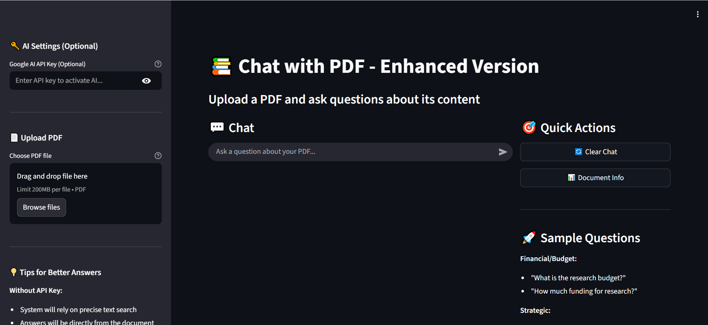

<div align="center">

# 📚 Chat with PDF - AI-Powered Document Q&A System

<p align="center">
  
</p>

<p align="center">
  
  
  
  
</p>

<p align="center">
  <strong>An intelligent document analysis system that enables natural language conversations with PDF documents using RAG (Retrieval-Augmented Generation) technology.</strong>
</p>

<p align="center">
  <a href="#-features">Features</a> •
  <a href="#-demo">Demo</a> •
  <a href="#-installation">Installation</a> •
  <a href="#-usage">Usage</a> •
  <a href="#-architecture">Architecture</a> •
  <a href="#-technologies">Technologies</a>
</p>

</div>

---

## 🎯 Features

<table>
<tr>
<td width="50%">

### 🔍 **Smart Document Processing**
- ✅ PDF text extraction and intelligent chunking
- ✅ Multilingual support with advanced embeddings
- ✅ Context-aware text splitting with overlap
- ✅ Optimized chunk sizes for better retrieval

</td>
<td width="50%">

### 🤖 **AI-Powered Q&A**
- ✅ Google Gemini 2.0 Flash integration
- ✅ RAG-based accurate responses
- ✅ Context-aware answer generation
- ✅ Real-time interactive chat interface

</td>
</tr>
<tr>
<td width="50%">

### ⚡ **High Performance**
- ✅ FAISS vector similarity search
- ✅ Sentence-Transformers embeddings
- ✅ GPU acceleration support (Tesla T4)
- ✅ Efficient document indexing

</td>
<td width="50%">

### 🎨 **User Experience**
- ✅ Clean Streamlit web interface
- ✅ Real-time chat history
- ✅ Document information dashboard
- ✅ Sample questions for guidance

</td>
</tr>
</table>

---

## 🚀 Demo

### Interface Preview

```
📚 Chat with PDF - Enhanced Version
├── Upload PDF Document
├── Enter Google Gemini API Key
├── Ask Questions in Natural Language
└── Get AI-Generated Answers with Context
```

### Sample Interactions

```python
# Financial Questions
Q: "What is the research budget?"
A: [AI extracts and explains budget information from document]

# Strategic Questions
Q: "What are the main priorities?"
A: [AI summarizes key priorities with relevant context]

# General Questions
Q: "Explain the key points"
A: [AI provides comprehensive overview from document]
```

---

## 📦 Installation

### Prerequisites

- Python 3.11 or higher
- pip package manager
- Google Gemini API key ([Get one here](https://ai.google.dev/))

### Quick Start

1️⃣ **Clone the repository**
```bash
git clone https://github.com/yourusername/chat-with-pdf.git
cd chat-with-pdf
```

2️⃣ **Install dependencies**
```bash
pip install -r requirements.txt
```

3️⃣ **Run the application**
```bash
streamlit run app.py
```

4️⃣ **Open your browser**
```
Navigate to: http://localhost:8501
```

### Requirements.txt

```txt
transformers==4.52.4
sentence-transformers
PyPDF2
faiss-cpu
streamlit
langchain
google-generativeai
google-genai
torch
numpy
pandas
pyngrok
python-multipart
```

---

## 💻 Usage

### Basic Workflow

```python
# 1. Upload PDF Document
uploaded_file = st.file_uploader("📄 Upload PDF")

# 2. Enter API Key
api_key = st.text_input("🔑 Google Gemini API Key", type="password")

# 3. Ask Questions
user_question = st.chat_input("💬 Ask a question about your document...")

# 4. Get AI-Powered Answers
answer = qa_system.answer_question(user_question, api_key)
```

### Advanced Configuration

```python
# Customize chunk parameters
chunk_size = 800        # Characters per chunk
chunk_overlap = 100     # Overlap between chunks

# Adjust retrieval settings
k_neighbors = 3         # Number of relevant chunks to retrieve

# Configure embedding model
embedding_model = "sentence-transformers/all-MiniLM-L6-v2"
```

---

## 🏗️ Architecture

### System Flow Diagram


### RAG Pipeline

```
┌─────────────────────────────────────────────────────────────────┐
│                    DOCUMENT PROCESSING                          │
├─────────────────────────────────────────────────────────────────┤
│  PDF → Text Extraction → Chunking → Embeddings → FAISS Index   │
└─────────────────────────────────────────────────────────────────┘
                               ↓
┌─────────────────────────────────────────────────────────────────┐
│                    QUERY PROCESSING                             │
├─────────────────────────────────────────────────────────────────┤
│  User Query → Embedding → Similarity Search → Top-K Chunks      │
└─────────────────────────────────────────────────────────────────┘
                               ↓
┌─────────────────────────────────────────────────────────────────┐
│                    ANSWER GENERATION                            │
├─────────────────────────────────────────────────────────────────┤
│  Context + Query → Google Gemini 2.0 Flash → Generated Answer  │
└─────────────────────────────────────────────────────────────────┘
```

---

## 🛠️ Technologies

### Core Components

| Component | Technology | Purpose |
|-----------|-----------|---------|
| **Frontend** | Streamlit | Interactive web interface |
| **PDF Processing** | PyPDF2 | Text extraction from PDFs |
| **Text Splitting** | LangChain | Intelligent document chunking |
| **Embeddings** | Sentence-Transformers | Semantic text representation |
| **Vector Search** | FAISS | Fast similarity search |
| **AI Model** | Google Gemini 2.0 Flash | Answer generation |
| **Deep Learning** | PyTorch | Neural network operations |

### Key Algorithms

- **Embedding Model**: `sentence-transformers/all-MiniLM-L6-v2` (Multilingual)
- **Vector Search**: FAISS IndexFlatL2 (L2 distance)
- **Text Splitting**: Recursive Character Text Splitter
- **LLM**: Google Gemini 2.0 Flash Experimental

---

## 📂 Project Structure

```
chat-with-pdf/
│
├── 📓 LLM-Second-Task.ipynb    # Main Jupyter notebook
├── 🐍 app.py                    # Streamlit application
├── 🚀 deploy.py                 # Deployment script (ngrok)
├── 📋 requirements.txt          # Python dependencies
├── 📖 README.md                 # This file
│
├── 📁 models/                   # Pre-trained models (auto-downloaded)
├── 📁 data/                     # Sample PDFs for testing
└── 📁 outputs/                  # Generated embeddings cache
```

---

## 🔧 Configuration

### Environment Variables

```bash
# Optional: Set default API key
export GOOGLE_API_KEY="your-gemini-api-key"

# Optional: Configure ngrok token for deployment
export NGROK_AUTH_TOKEN="your-ngrok-token"
```

### Streamlit Configuration

```toml
# .streamlit/config.toml
[theme]
primaryColor = "#553c9a"
backgroundColor = "#0e1117"
secondaryBackgroundColor = "#262730"
textColor = "#fafafa"

[server]
port = 8501
headless = true
```

---

## 🚀 Deployment

### Option 1: Local Deployment
```bash
streamlit run app.py
```

### Option 2: Ngrok Tunnel (Remote Access)
```bash
python deploy.py
```

### Option 3: Cloud Deployment

**Streamlit Cloud:**
```bash
# Push to GitHub and deploy via Streamlit Cloud
# https://streamlit.io/cloud
```

**Docker:**
```dockerfile
FROM python:3.11-slim
WORKDIR /app
COPY requirements.txt .
RUN pip install -r requirements.txt
COPY . .
EXPOSE 8501
CMD ["streamlit", "run", "app.py"]
```

---

## 📊 Performance Metrics

| Metric | Value |
|--------|-------|
| **PDF Processing Speed** | ~1-2 seconds per page |
| **Embedding Generation** | ~0.1 seconds per chunk |
| **Query Response Time** | ~2-3 seconds |
| **Supported PDF Size** | Up to 100MB |
| **Concurrent Users** | 10+ (Streamlit default) |

---

## 🤝 Contributing

Contributions are welcome! Please follow these steps:

1. Fork the repository
2. Create a feature branch (`git checkout -b feature/AmazingFeature`)
3. Commit your changes (`git commit -m 'Add some AmazingFeature'`)
4. Push to the branch (`git push origin feature/AmazingFeature`)
5. Open a Pull Request

---

## 🙏 Acknowledgments

- **Google Gemini** - Advanced AI language model
- **Meta AI** - FAISS vector search library
- **Hugging Face** - Sentence-Transformers models
- **Streamlit** - Beautiful web framework
- **LangChain** - LLM application framework

---

## 📧 Contact

**Developer**: Ahmed Hussein  
**Email**: ahmedhussein12215@gmail.com  
**GitHub**: [@A7med668](https://github.com/A7med668)  
**LinkedIn**: [ahmed-hussein](https://www.linkedin.com/in/ahmed-hussein-07887431a/)

---

<div align="center">

### ⭐ Star this repository if you find it helpful!

Made with ❤️ and ☕ by [Ahmed Hussein]

[](https://github.com/A7med668/PDF-RAGify/stargazers)
[](https://github.com/A7med668/PDF-RAGify/network/members)
[](https://github.com/A7med668/PDF-RAGify/watchers)

</div>
